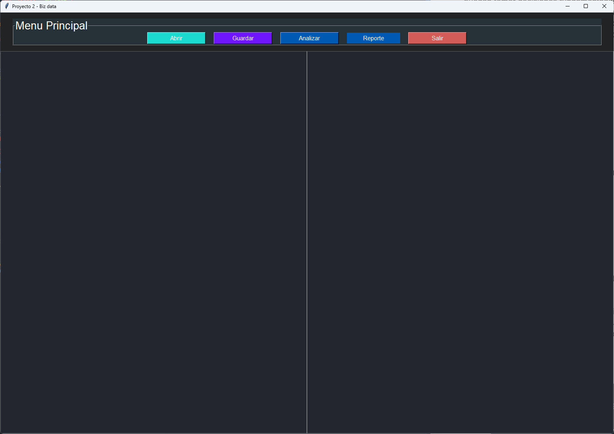
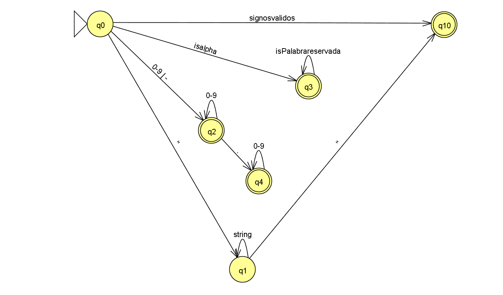
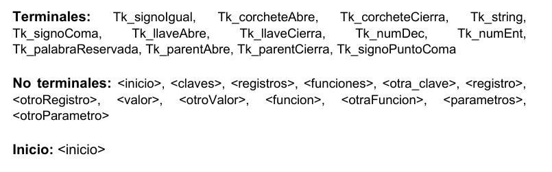
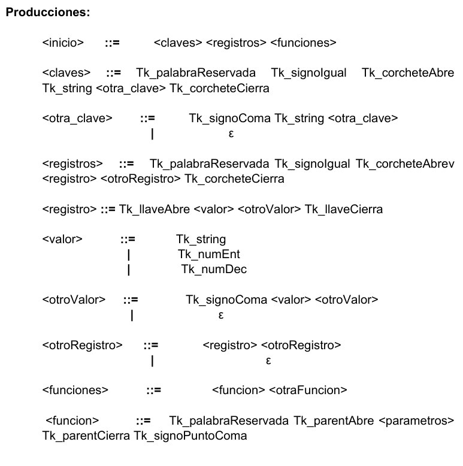
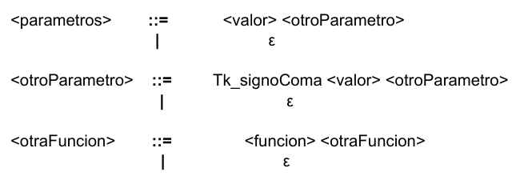

UNIVESIDAD DE SAN CARLOS DE GUATEMALA

FACULTAD DE INGENIERIA

ESCUELA DE CIENCAS Y SISTEMAS

LENGUAJES FORMALES Y DE PROGRAMACION

SECCIÓN A-

SEGUNDO SEMESTRE 2023

AUX. ENRIQUE ALEJANDRO PINULA QUIÑONEZ

Edgar Rolando Ramirez Lopez

201212891

Guatemala, octubre del 2023


# <p align="center"> **MANUAL TECNICO** </p>

# Introduccion

Este manual técnico proporciona información detallada sobre el proyecto "Biz Data", que consiste en una aplicación de procesamiento de datos y análisis sintáctico de un lenguaje específico. La aplicación incluye una interfaz gráfica para cargar archivos de texto, analizar su contenido utilizando un analizador léxico y sintáctico, y generar informes de errores y resultados. El proyecto se implementó en Python 3 utilizando la biblioteca tkinter para la interfaz gráfica.

#	Contenido tecnico
El programa se compone de los siguientes archivos:

1. main.py: Este archivo contiene la interfaz gráfica de usuario (GUI) desarrollada con Tkinter. La GUI permite cargar archivos de texto, realizar análisis léxicos, ver tokens, errores léxicos y resultados de operaciones.

2. analizador_lexico.py: Contiene la implementación del analizador léxico, que se utiliza para escanear el código de entrada y reconocer tokens específicos en el lenguaje de destino.

3. Token.py y error_lexico.py: Estos archivos definen las clases Token y Error, respectivamente, que se utilizan para representar los tokens y errores léxicos en el programa.

4. Parser.py: Implementa el analizador sintáctico que procesa los tokens reconocidos por el analizador léxico y verifica si siguen una estructura gramatical válida.

#   Requisitos del Sistema

- Python 3.x (instalado y configurado).

- Las siguientes bibliotecas de Python: tkinter, filedialog, messagebox, webbrowser.

- Navegador web (para ver los informes generados).
Sistema operativo compatible con Python.

#   Instalación y Ejecución

1. Asegúrese de tener Python 3 instalado en su sistema.

2. Descargue el código fuente del proyecto y guarde todos los archivos en el mismo directorio o carpeta.

3. Abra una terminal o línea de comandos y navegue hasta el directorio donde se encuentran los archivos del proyecto.

4. Ejecute el programa utilizando el siguiente comando:
```
python main.py
```

5. Se abrirá la interfaz gráfica de usuario, que le permitirá interactuar con el programa.


# Uso del Programa
## Interfaz Gráfica de Usuario
La interfaz de usuario de "Biz Data" consta de los siguientes componentes principales:

- Área de Texto 1: Un área de texto en la que se puede cargar, ver y editar el contenido del archivo de entrada.

- Área de Texto 2: Otra área de texto utilizada para mostrar resultados, informes y mensajes de estado.

- Botones de Archivo: Un menú que contiene las siguientes opciones:

    - Abrir: Permite seleccionar un archivo de tipo `.bizdata` para cargar.

    - Guardar: Guarda el contenido modificado en el archivo actualmente abierto.

    - Analizar: Inicia el proceso de análisis léxico y sintáctico del código cargado.

    - Reporte: Permite generar informes, como un informe de errores, un informe de tokens reconocidos y un árbol de gramática.

    - Salir: Cierra la aplicación.



# Funcionalidades Principales
## Carga de Archivos
Al seleccionar la opción `Abrir`, se abrirá un cuadro de diálogo que le permitirá seleccionar un archivo de tipo `.bizdata`. El contenido del archivo se mostrará en el área de texto 1 de la aplicacion, este archivo se puede modificar en el area de texto y al seleccionar el boton Guardar se guardaran los cambios realizados.

## Análisis Léxico y Sintáctico
Al seleccionar la opción `Analizar`, el programa realizará un análisis léxico y sintáctico del contenido del archivo cargado y mostrara los resultados del analisis sintactico en el area de texto 2. 

- El analizador léxico se implementa en el archivo `analizador_lexico.py` y escanea el código de entrada carácter por carácter y reconoce tokens específicos. Cada token reconocido se representa como una instancia de la clase `Token`, que contiene información sobre el tipo, lexema, fila y columna del token.

- El analizador sintáctico se implementa en el archivo `Parser.py` y procesa los tokens reconocidos por el analizador léxico y verifica si siguen una estructura gramatical válida.

## Generación de Informes
Al seleccionar el submenu `Reporte` el usuario puede elegir cualquiera de las siguientes opciones:

- Reporte de Errores: Muestra los errores encontrados en el código en una pagina web.

- Reporte de Tokens: Muestra los tokens reconocidos en el código en una pagina web.

- Arbol de la Gramática: Visualiza un árbol de análisis sintáctico del código.

## Archivos de Salida
La aplicación genera varios archivos de salida:

- tokens_report.html: Un informe en formato HTML que muestra los tokens reconocidos en el código.

- ERRORES.html: Un informe en formato HTML que muestra los errores sintácticos en el código.

- resultados_sintacticos_temps.txt: Un archivo de texto que contiene los mensajes de registro del análisis sintáctico.


## Guardar 
Las opcion "Guardar" permiten guardar el contenido actual en el archivo abierto.


# Autómata Finito Determinista

Modelo matemático utilizado en teoría de la computación y en el análisis léxico de lenguajes de programación. Un AFD es una máquina abstracta que puede encontrarse en un conjunto finito de estados y que, dado un símbolo de entrada, transita de un estado a otro siguiendo una función de transición. En el contexto de "Biz Data," el análisis léxico se basa en un AFD para reconocer y clasificar tokens en el código fuente. Un AFD puede representar la lógica para detectar palabras clave, identificadores, números, operadores, y otros componentes del lenguaje.

## AFD del analizar lexico


- signosvalidos: Son los signos validos que se admiten como tokens los cuales son: { } [ ] , () = ;
- isPalabrareservada: Son las palabras admitidas en el analizador lexico: Claves, Registros, imprimir, imprimirln, datos, conteo,contarsi, exportarReporte, promedio, sumar, max, min.

# Gramáticas Libres de Contexto (GLC)

Son una forma de describir la sintaxis de un lenguaje formal mediante reglas de producción. Una GLC consta de un conjunto de símbolos terminales (como palabras clave y símbolos en el código fuente) y un conjunto de símbolos no terminales (que representan estructuras gramaticales). Estas gramáticas son utilizadas en análisis sintáctico para definir la estructura jerárquica de un lenguaje, como las reglas de precedencia y asociatividad de operadores. En "Biz Data," se emplean GLC para definir la gramática del lenguaje de entrada, lo que permite realizar un análisis sintáctico y validar la estructura del código según las reglas definidas en la gramática.

## GLC del analizador sintactico






## Conclusiones
El proyecto "Biz Data" representa una herramienta versátil y útil para aquellos que requieren análisis de texto y procesamiento de datos, además de la capacidad de detectar errores en un código fuente. Su interfaz gráfica intuitiva y fácil de usar permite a los usuarios cargar, visualizar y editar archivos de texto de manera eficiente. La funcionalidad de análisis léxico y sintáctico proporciona una valiosa utilidad para identificar problemas en el código, lo que es particularmente beneficioso para los desarrolladores y programadores. Además, la capacidad de generar informes de errores y tokens reconocidos facilita la revisión y corrección de código. Aunque existen algunas limitaciones, como la visualización de informes en la interfaz gráfica, estos problemas pueden superarse al abrir los informes en un navegador web. En última instancia, "Biz Data" es una aplicación escalable que se puede adaptar a requisitos específicos, lo que la convierte en una herramienta valiosa en el campo del procesamiento de datos y desarrollo de software.

