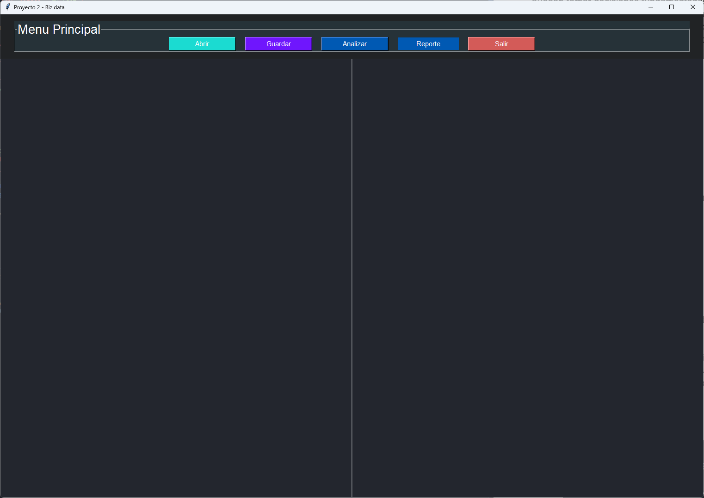
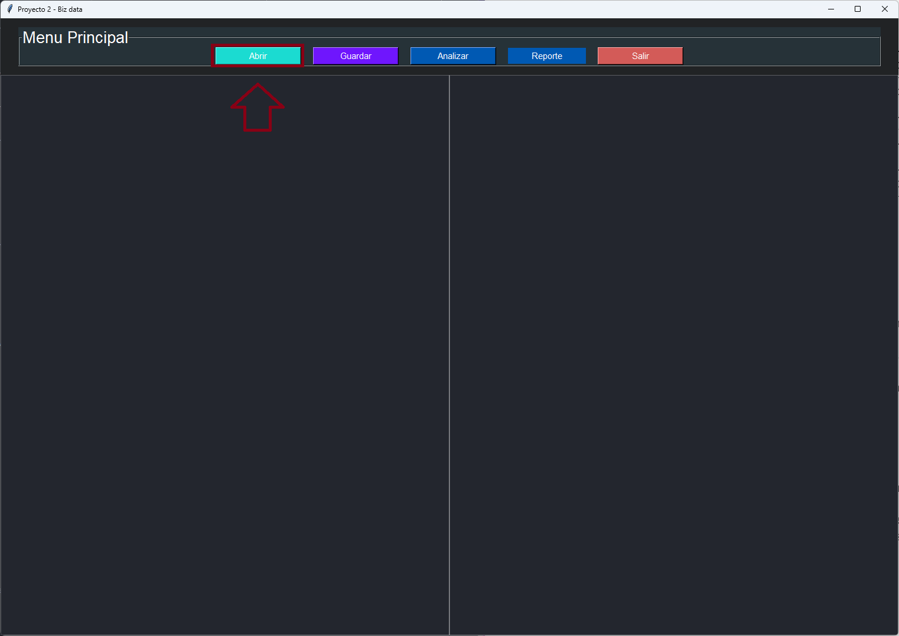

UNIVESIDAD DE SAN CARLOS DE GUATEMALA

FACULTAD DE INGENIERIA

ESCUELA DE CIENCAS Y SISTEMAS

LENGUAJES FORMALES Y DE PROGRAMACION

SECCIÓN A-

SEGUNDO SEMESTRE 2023

AUX. ENRIQUE ALEJANDRO PINULA QUIÑONEZ

Edgar Rolando Ramirez Lopez

201212891

Guatemala, septiembre del 2023

# 
 MANUAL DE USUARIO 

Este manual de usuario proporciona instrucciones detalladas sobre cómo utilizar el programa desarrollado en Python con interfaz gráfica de usuario (GUI) utilizando la biblioteca Tkinter. El programa está diseñado para cargar, analizar y trabajar con archivos tipo `bizdata` que contiene la estructura de datos y funcionalidades varias para visualizar la informacion, además el programa puede generar informes de tokens y errores léxicos y sintacticos.

## INTRODUCCION

 El programa "Biz Data", una aplicación de procesamiento de datos y análisis sintáctico de un lenguaje específico. Este manual le proporcionará información sobre cómo utilizar la aplicación para cargar archivos de texto, realizar análisis léxicos y sintácticos, y generar informes de errores y resultados. "Biz Data" es una herramienta versátil que le ayudará a analizar y comprender el contenido de sus archivos de texto. A continuación, se detallan las instrucciones para utilizar la aplicación de manera efectiva.

## Interfaz de Usuario
La interfaz de usuario de "Biz Data" consta de los siguientes componentes:

- Área de Texto 1: Aquí puede cargar, ver y editar el contenido del archivo de texto.

- Área de Texto 2: Esta área se utiliza para mostrar resultados, informes y mensajes de estado.

- Botones de Archivo: El menú "Archivo" contiene las siguientes opciones:

    - Abrir: Permite seleccionar un archivo de texto para cargar.

    - Guardar: Guarda los cambios en el archivo actualmente abierto.

    - Analizar: Inicia el proceso de análisis léxico y sintáctico del código cargado.

    - Reporte: Permite generar informes, como un informe de errores, un informe de tokens reconocidos y un árbol de gramática.

    - Salir: Cierra la aplicación.

## Carga de Archivos
- Haga clic en el botón "Abrir".
    
    

- Se abrirá un cuadro de diálogo para seleccionar un archivo un archivo bizdata (.bizdata). Y seleccionar el archivo que desea cargar y haga clic en "Abrir".
    
    

3. Una vez que el archivo se carga, puede ver y editar su contenido en el "Área de Texto 1".
    
    

4. Para guardar los cambios, haga clic en el botón "Guardar". 

## Análisis Léxico y Sintáctico

1. Después de cargar un archivo, haga clic en el botón "Analizar" para iniciar el proceso de análisis.

    

2. Los resultados del análisis se mostrarán en el "Área de Texto 2". Aquí se informarán sobre errores sintácticos, si los hubiera.

    

## Generación de Informes

1. Utilice la opción "Reporte" en el menú de archivo para generar diferentes informes:

    

    - Reporte de Errores: Muestra los errores encontrados en el código, si los hay y los muestra en una pagina web.

        

    - Reporte de Tokens: Muestra los tokens reconocidos en el código y los muestra en una pagina web.

        

## Salir del Programa
- Haga clic en el botón "Salir" para cerrar la aplicación.

## Conclusiones
 "Biz Data" es una herramienta eficaz que proporciona a los usuarios una interfaz intuitiva para cargar, analizar y comprender archivos de texto, junto con la capacidad de generar informes detallados. Esta aplicación simplifica el proceso de análisis léxico y sintáctico, permitiendo a los usuarios identificar posibles errores y visualizar los tokens reconocidos en su código. La función general de "Biz Data" es valiosa para profesionales y desarrolladores que desean analizar código o contenido de texto de manera eficiente. Con su capacidad de guardar y cargar archivos, "Biz Data" ofrece una solución útil para el procesamiento y análisis de datos.
